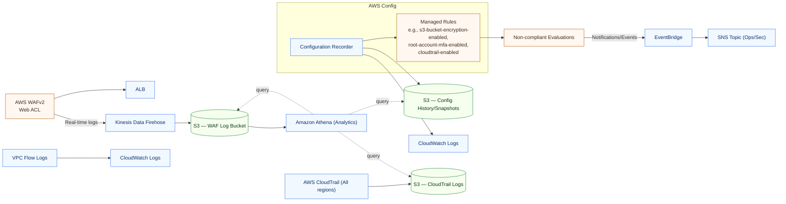

# AWS Web App — Security-Focused Architecture

> **Scope:** Diagram reflects the current repo structure and README description. It emphasizes **AWS Config** and **AWS WAF** telemetry, controls, and data flows.

---

## 1) High‑Level: Ingress → App → Data (with guardrails)

```mermaid
flowchart LR
  %% Layout
  classDef aws fill:#f1f8ff,stroke:#2f6feb,stroke-width:1px,color:#0a3069;
  classDef sec fill:#fff7f0,stroke:#b35900,stroke-width:1px,color:#3d2b1f;
  classDef data fill:#f6ffed,stroke:#1a7f37,stroke-width:1px,color:#0a3622;
  classDef net fill:#f5f0ff,stroke:#8250df,stroke-width:1px,color:#2c1760;
  classDef svc fill:#f8f9fa,stroke:#666,stroke-width:1px,color:#111;

  Internet[[Internet]]:::svc --> WAF["AWS WAFv2<br/>Web ACL"]:::sec
  WAF --> ALB["Application Load Balancer<br/>(HTTPS)"]:::aws

  subgraph VPC[Amazon VPC]
    IGW[(Internet Gateway)]:::net
    NAT[(NAT Gateway)]:::net

    subgraph Public[Public Subnets (2+ AZs)]
      ALB
      IGW
      ALB --- IGW
    end

    subgraph Private[Private Subnets (2+ AZs)]
      EC2["EC2 Web Tier<br/>(AutoScaling or 1-2 instances)"]:::aws
      RDS["Amazon RDS<br/>Postgres/MySQL (KMS‑encrypted)"]:::data
      EC2 -->|JDBC 5432/3306| RDS
      EC2 -->|Egress via NAT| NAT
    end
  end

  ALB -->|HTTPS 443| EC2

  %% Storage & Logs
  S3Assets[(S3 — Static Assets)]:::data
  S3Logs[(S3 — Access & WAF Logs)]:::data
  ALB -. Access Logs .-> S3Logs
  EC2 -. App Logs .-> CWLogs["CloudWatch Log Groups<br/>(KMS‑encrypted)"]:::aws

  %% State and pipeline
  subgraph CI[CI/CD — GitHub Actions]
    TF[Terraform Plan/Apply]:::svc
    Scanners["Security Scans:<br/>tfsec • Checkov • Trivy • Semgrep • Gitleaks"]:::sec
    ZAP[DAST: OWASP ZAP]:::sec
    TF -->|S3 Backend| State[(S3 Remote State)]:::data
    TF -->|Lock| DDB[(DynamoDB Lock Table)]:::data
    ZAP -->|Scan| ALB
  end
```

---

## 2) Security Telemetry & Governance (AWS Config + WAF focus)



---

## 3) Security Controls Cheat‑Sheet (what the diagram implies)

- **Ingress hardening:** `AWS WAFv2` WebACL associated with the **ALB**; HTTPS‑only; OWASP Top‑10 mitigations; WAF logging via **Kinesis Data Firehose → S3** for audits/forensics.
- **Network isolation:** Public subnets host only the **ALB** and egress infra; **EC2/RDS** live in private subnets behind **security groups** (least‑privilege ports).
- **Data‑at‑rest:** **RDS**, **CloudWatch Log Groups**, and **S3 buckets** use **KMS** encryption.
- **Telemetry:** **ALB access logs**, **WAF logs**, **VPC Flow Logs**, **CloudTrail**, **App logs** to S3/CloudWatch for centralized visibility.
- **Configuration governance:** **AWS Config** recorder + **managed rules** evaluate resources (S3 encryption/versioning, root account MFA, CloudTrail enabled, etc.). Config history/snapshots stored in S3.
- **Pipeline guardrails:** Terraform plans gated by **tfsec / Checkov**; supply‑chain checks with **Trivy / Semgrep**; **Gitleaks** prevents secrets in Git; **ZAP** runs DAST against the ALB.
- **State hygiene:** Terraform **S3 backend** + **DynamoDB lock** to avoid drift/concurrency.

---

## 4) How to embed this in your repo

- Drop this file into `docs/aws-security-architecture.md` (or rename as you prefer).
- In your `README.md`, add a link and a preview image if you want:

  - GitHub **renders Mermaid automatically** inside Markdown; no extra tooling needed.
  - Example snippet:

    ```md
    ## Architecture

    See **[Security-Focused Architecture](docs/aws-security-architecture.md)**
    ```